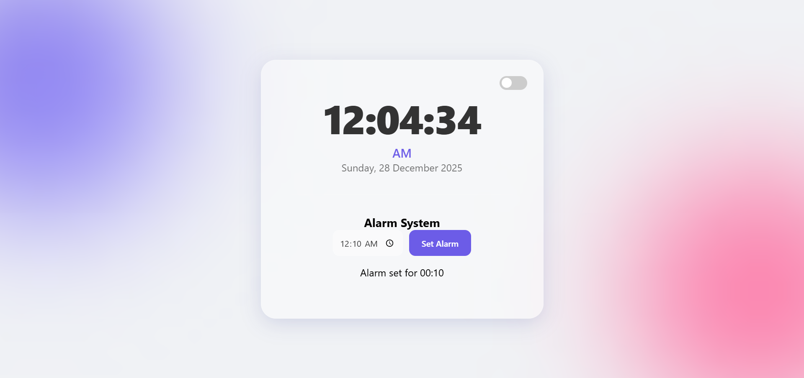
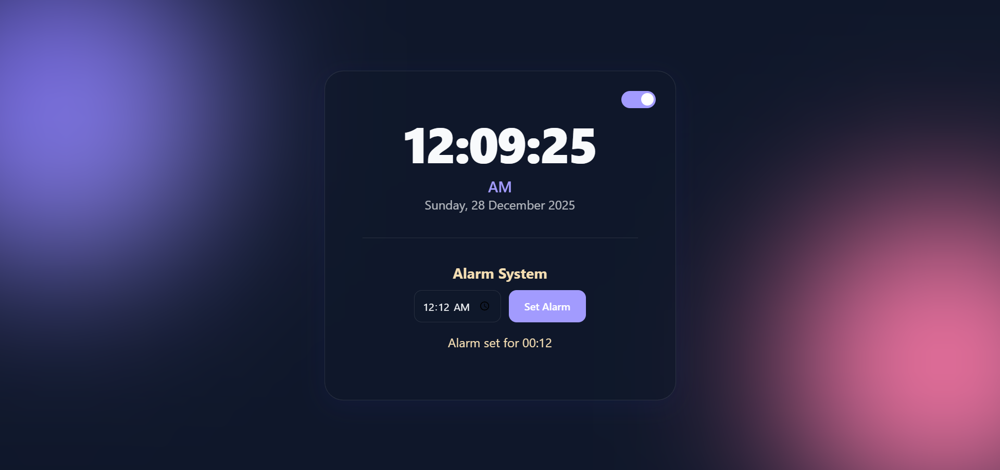

# 🕒 Modern Interactive Digital Clock
A sleek, high-performance digital clock with a glassmorphism design, theme persistence, and an advanced alarm system with snooze functionality.

---

## 📸 Project Preview

<p align="center">
  
  
</p>

---

## ✨ Features

- **Glassmorphism UI:** Modern, translucent design with a blur effect.
- **Real-time Clock:** Displays time in `HH:MM:SS AM/PM` format with the full date.
- **Theme Switcher:** Seamless transition between **Light Mode** and **Dark Mode**.
- **Persistence:** Remembers your theme preference using `localStorage`.
- **Advanced Alarm:** - Notification sound when the time matches.
    - **Snooze Feature:** Postpone the alarm for 10 minutes easily.
- **Fully Responsive:** Beautifully adapts to Desktop, Tablet, and Mobile screens.

---

## 🚀 Tech Stack

- **HTML5**
- **CSS3** (Custom Variables, Flexbox, Glassmorphism)
- **JavaScript** (ES6+, LocalStorage, Event Loops)

---

## 🛠️ Installation & Usage

1. **Clone the repository:**
   ```bash
   git clone [https://github.com/RashedDevX/digital-clock.git](https://github.com/RashedDevX/digital-clock.git)